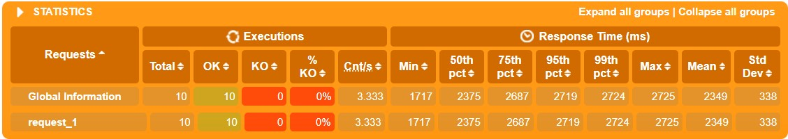
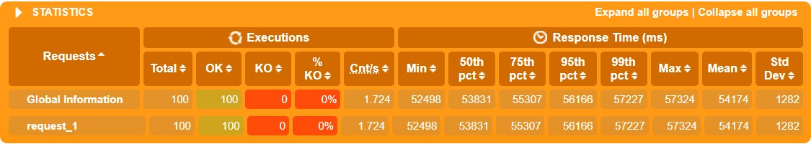
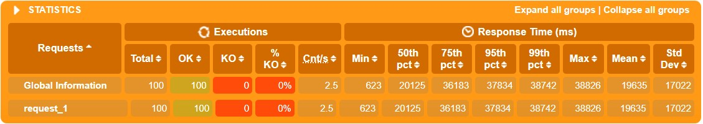
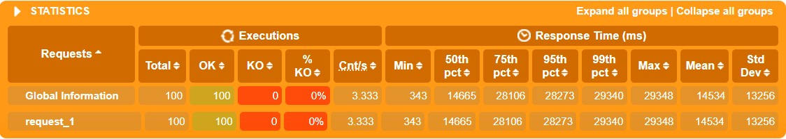
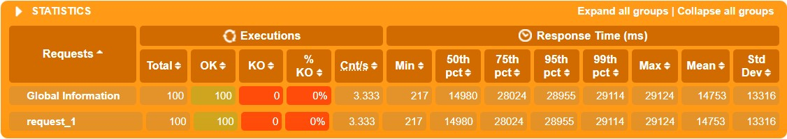
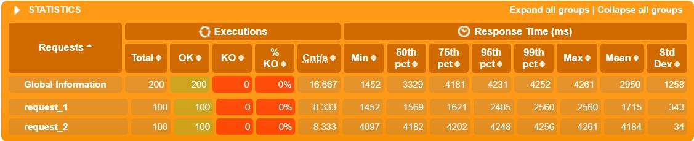

# WebPOS

The demo shows a web POS system , which replaces the in-memory product db in aw03 with a one backed by 京东.


To run

```shell
mvn clean spring-boot:run
```

Currently, it creates a new session for each user and the session data is stored in an in-memory h2 db. 
And it also fetches a product list from jd.com every time a session begins.

1. Build a docker image for this application and perform a load testing against it.
2. Make this system horizontally scalable by using haproxy and perform a load testing against it.
3. Take care of the **cache missing** problem (you may cache the products from jd.com) and **session sharing** problem (you may use a standalone mysql db or a redis cluster). Perform load testings.

Please **write a report** on the performance differences you notice among the above tasks.

------

# Report

## Scale Up

在垂直扩展的负载测试中，共测试了三个不同的 docker 镜像，其中参数分别设置为 `--cpus=0.5`，`--cpus=1`，`--cpus=1.5`，即理论上的 cpu 性能为一倍、两倍、三倍。测试结果如下：

1. scale-up-0.5:

   

2. scale-up-1:

   

3. scale-up-1.5:

   

从上述三次测试结果中可以明显看出，随着垂直扩展的规模增大，平均响应时间由 3548ms 缩短到了 1040ms，服务器性能得到显著提升；

## Load Balance

在水平扩展，即负载均衡的负载测试中，所有 docker 镜像均设置为 `--cpus=0.5`，共运行四个镜像；三次测试的不同之处在于，每次参与测试的镜像数分别为 1，2，4 个，彼此之前通过 Haproxy 的 `balance roundrobin` 来进行负载均衡。测试结果如下：

1. load-balance-1:

   

2. load-balance-2:

   

3. load-balance-4:

   

从上述三次测试结果可以看出，当系统由一台服务器扩展到两台服务器时，平均响应时间由 54174ms 下降到了 19635ms，系统性能显著提升；而当由两台服务器扩展到四台服务器时，平均响应时间由 19635ms 下降到了 14534ms，并无显著改善，由此猜测针对本次负载测试，两到三台服务器组成的系统已基本达到性能上限，想要进一步提高响应性能需要成倍数地添加新的服务器，性价比较低；

## Cache

在引入缓存机制的负载测试中，其余所有设置均与 Load Balance 相同。测试结果如下：

1. cache-1:

   

2. cache-2:

   

3. cache-4:

   

根据上述三次测试结果，在横向对比中我们可以发现平均响应时间的下降趋势与 Load Balance 中基本一致，而在纵向对比中可以发现相同配置的前后两次测试，引入缓存机制后平均响应时间均小于引入前，由此可见缓存机制在本次三组测试中发挥了作用，减少了响应时间；

## Redis

为避免 Cache Missing 和 Session Share 问题，本次测试中使用 redis 作为缓存，并采用 Haproxy 的 `cookie  SESSION_COOKIE  insert indirect nocache` 。测试在本机上进行，结果如下：



在该测试中，由于使用 session 机制，需要测试脚本额外增加 login 步骤，因此与前面几组测试无法形成对照；但是通过定性分析，可以看出本次测试在模拟 100 个用户请求的情况下，平均响应时间只有 2950ms ，不致使用户感到明显卡顿，足以满足日常使用需求。由此可见引入 redis 和借助 Haproxy 来解决 Cache Missing 及 Session Share 问题，效果显著。

## 附：

本报告中提及的所有测试结果均可在 `report/index/` 中找到。